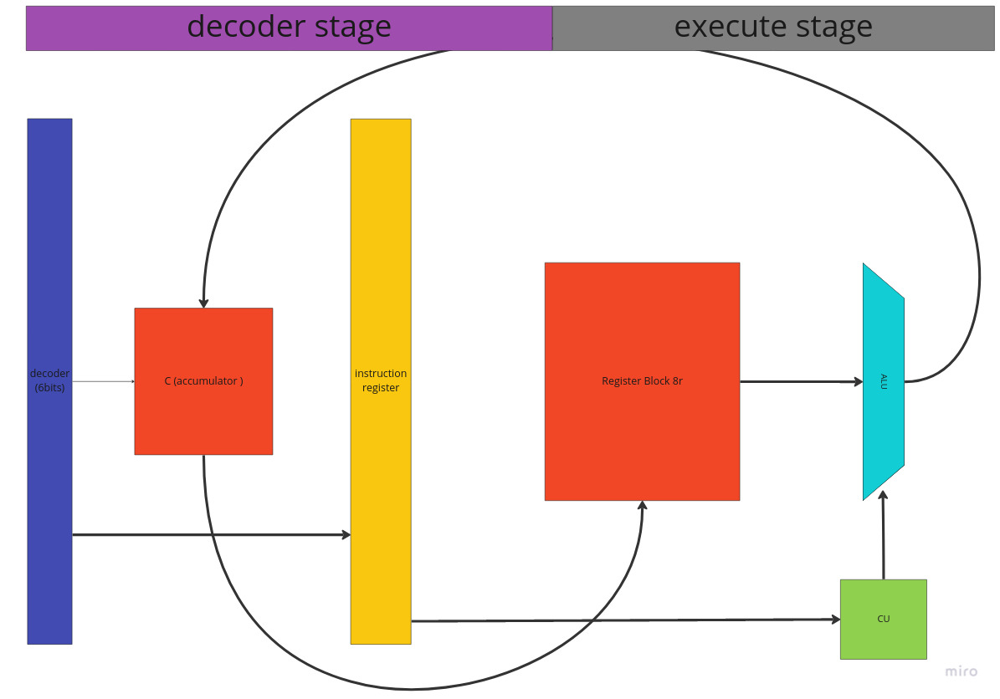

## 8 Bit Data path cpu with 6 bit instruction set.

### Instruction Set (G++)

`load` saves the imm value into temp reg 
1 - [4:0]imm. 

`conditional branches` if the value in the register is bigger than the accumulator jump back the number in the accumulator.

011 - imm[2:0] (register addr)

`stra` stores the value from the accumulator  to a program register
001 - imm[2:0]

`add` adds acumulator and a register and saves it to acumulator
010 - imm[2:0] (register addr)

`neg` negates the value of the accumulator
000001

## Architecture 
The cpu uses a two satge pipeline allowing it to execute an instruction every two cycles.

it has 8 general purpose registers, 1 accumulator and a program counter register.

## example program (fibonacci) 
 
 ''' a
        inst = 6'b000000; //nop      0
		inst = 6'b100001;  //ld1      33
		inst = 6'b001001;  //stra r1  9
        inst = 6'b100000; //ld0     32
        inst = 6'b001010; //stra r2 10

        //sum r1+r2 save on r1
        inst = 6'b100000; //ld0     32
        inst = 6'b010001; //add1 // 17
        inst = 6'b010010; //add2    18
        inst = 6'b001001; //stra r1  9

        //sum r1+r2 save on r2
        inst = 6'b100000; //ld0     32
        inst = 6'b010010; //add2    18
        inst = 6'b010001; //add1    17
        inst = 6'b001010; //stra r2 10
        
        //while(1) loop 
        inst = 6'b101100; //ld 11 +1 45
        inst = 6'b001011; //stra r3  11
        inst = 6'b101011; //ld 11    44
        inst = 6'b011011; //br 3     27 

 '''